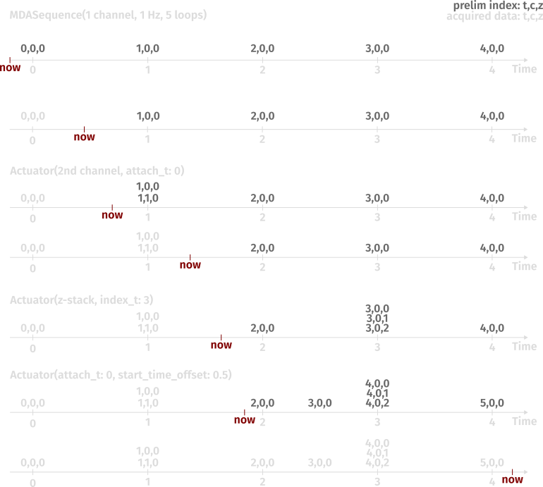

# pymmcore-eda
Run dynamic acquisitions on the pymmcore-plus backend. The basic idea is, that independent actuators add acquisition events to a dynamic sequence that get ordered by their intrinsic properties. This allows for acquisitions where the sequence of events is not know a-priori.

<picture>
  <source media="(prefers-color-scheme: dark)" srcset="./QueueManager-dark.png">
  <source media="(prefers-color-scheme: light)" srcset="./QueueManager-light.png">
  
</picture>

# Main components
## QueueManager
Has a queue that can be passed to the pymmcore-plus MDAEngine to run acquisition events. Additionally a 'DynamicEventQueue' that contains a set of ordered Acquisition events (EDAEvents) that can be populated from independent 'actuators' that can be triggered in different ways to allow for dynamic, reactive, interactive and/or smart acquisitions. Also handles timing of the acquisition with a timer that triggers addition of events from the DynamicEventQueue to the queue for acquisition.

## DynamicEventQueue
Implements a SortedSet for the events and a register of the populated indexes. With this it can populate the event depending on its attach_index (if there) and the events already present in the set.

## EDASequence
Some of the MDASequence fields that are needed to inform the events about their ordering.
channels: The channels dimension is the one we can't order naively, we normally want to set the order of the channels to be acquired manually
axis_order: as in MDASequence. The EDAEvents use their attached sequence to decide where they should go.
z_direction: up/down/alternate 
analyzers, interpreters, actuators: components that define a EDASequence and essentially replace the generator function of the MDASequence for a dynamic acquisition.

## EDAEvent
Almost an MDAEvent, but mutable and without an index by default
Additional attach_index to be used to attach the event to another event already in the event set
Sequence field can be an EDASequence
len, eq, hash methods to get set functionality

## Actuators
Different example actuators showing how events could be added to the acquisition
### MDAActuator
Takes a MDASequence and adds all the events to the EventQueue, can be used to set a 'base skeleton' acquisition.
### ButtonActuator
Acquisition events can be added dynamically on a button press.
### SmartActuator
Can be triggered by a Signal to add events (here used for smart closed-loop acquisitions).

## Analysers, Interpreters
Examples of how the loop can be closed for smart acquisitions

## AdaptiveWriter
Writer based on the TensorstoreWriter in pymmcore-plus with additional functionality to work better for adaptive acquisitions that don't have a predefined size etc.