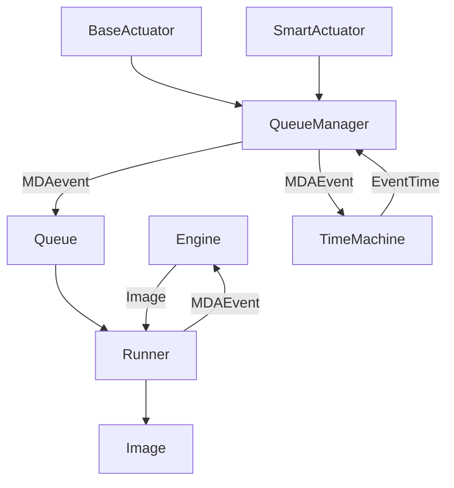
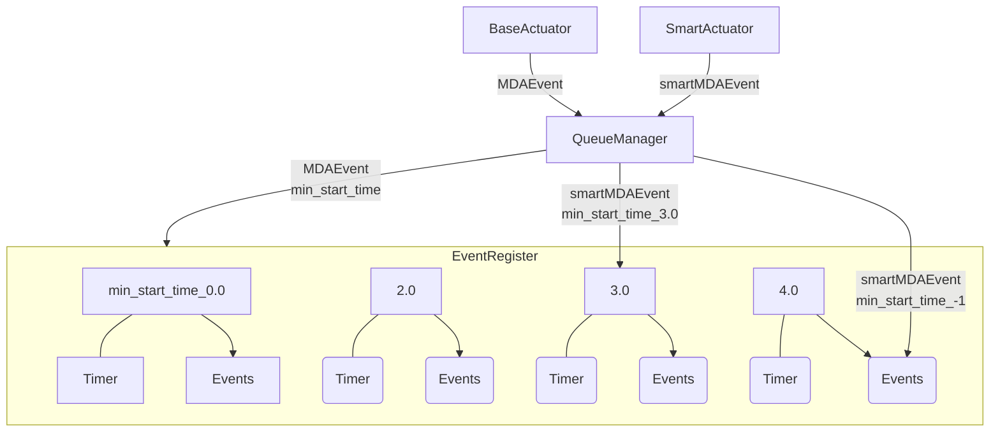

# mermaid flow chart for the project

```mermaid
graph TD;
    Engine
    Runner
    Queue
    BaseActuator
    SmartActuator
    QueueManager
    TimeMachine

    BaseActuator --> QueueManager
    SmartActuator --> QueueManager
    QueueManager -- MDAevent --> Queue
    QueueManager -- MDAEvent -->TimeMachine
    TimeMachine -- EventTime --> QueueManager
    Queue --> Runner
    Runner -- MDAEvent --> Engine
    Engine -- Image --> Runner
    Runner --> Image
```

# Actuator Queue interaction

```mermaid
graph TD;
    BaseActuator
    SmartActuator
    EventRegister
    ```mermaid
    subgraph EventRegister
        min_start_time_0.0 --- Timer
        min_start_time_0.0 --> Events
        2.0 --- Timer1(Timer)
        2.0 --> Events1(Events)
        3.0 --- Timer3(Timer)
        3.0 --> Events3(Events)
        4.0 --- Timer2(Timer)
        4.0 --> Events2(Events)
    end
    ```
    QueueManager

    BaseActuator -- MDAEvent --> QueueManager
    QueueManager -- MDAEvent<br>min_start_time --> EventRegister

    SmartActuator -- smartMDAEvent --> QueueManager
    QueueManager -- smartMDAEvent<br>min_start_time_-1 --> Events2
    QueueManager -- smartMDAEvent<br>min_start_time_3.0 --> 3.0
```

